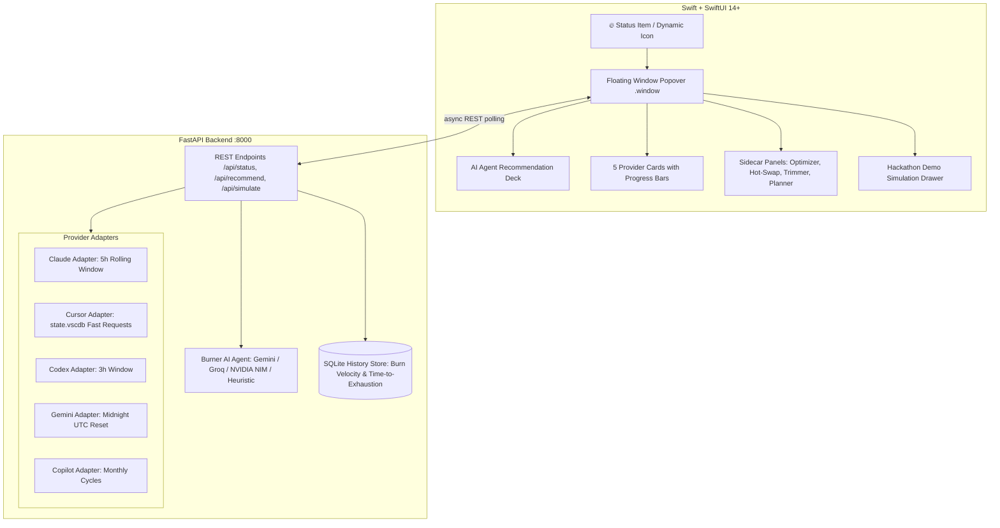

# Burner 🔥 — The AI Quota Menu Bar Agent

> **AI Builders Hackathon Submission**  
> *An ambient macOS menu bar agent that tracks your remaining quota across free-tier AI coding tools (Claude, Cursor, Codex, Gemini, Copilot), predicts burn-rate velocity, and proactively routes your tasks — before you hit a wall mid-refactor.*

---

### 💻 Platform & System Requirements

- **Operating System:** macOS 14.0+ (Sonoma) or macOS 15.0+ (Sequoia)
- **Architecture:** Designed for Mac — Apple Silicon (M1/M2/M3/M4) and Intel (x86_64) supported
- **Required Runtimes:** Python 3.10+ (powers the local agent reasoning backend) and Xcode 15+ (for building/running the native Swift client)
- **Assumptions:** Free-tier accounts or local desktop installs of any supported tools (Claude, Cursor, ChatGPT/Codex, Google Gemini, or GitHub Copilot). *An interactive simulation drawer is built-in for testing even if specific tools are not installed.*

---

### 🚀 How to Run Locally (Quickstart)

You can build and launch both the background Python agent and native macOS menu bar app with a single command using the provided `start.sh` script:

```bash
# 1. Clone the repository
git clone https://github.com/<your-username>/Burner.git
cd Burner

# 2. Start Burner
chmod +x start.sh
./start.sh
```

**What `start.sh` does automatically:**
1. **Clean Process Management:** Terminates any existing local instances on port 8000 and any running Burner instances to prevent port conflicts.
2. **Environment & Dependency Setup:** Sets up a dedicated Python virtual environment (`server/venv`), installs required dependencies from `server/requirements.txt`, and safely loads `.env` variables if present.
3. **Boots Agent Backend:** Starts the local FastAPI reasoning engine on `http://127.0.0.1:8000` and verifies `/health`.
4. **Compiles Swift Native App:** Incrementally compiles the native macOS menu bar app via `xcodebuild` into `./build/` without requiring manual Xcode interaction.
5. **Launches Menu Bar App:** Spawns `Burner.app` directly into your macOS top menu bar (look for the 🔥 flame icon).

#### Manual Developer Setup (Optional)
If you prefer running the backend and UI separately in debug mode:

1. **Start the local Agent Backend:**
   ```bash
   cd server
   python3 -m venv venv
   source venv/bin/activate
   pip install -r requirements.txt
   uvicorn server.main:app --port 8000 --reload
   ```

2. **Open & Run the Frontend in Xcode:**
   - Open `BurnerApp/Burner.xcodeproj` in Xcode.
   - Select the `Burner` scheme and press **Cmd + R**.
   - The 🔥 icon will appear in your top menu bar.

#### Testing & Verification
- **Automated Backend Tests:**
  ```bash
  PYTHONPATH=. ./server/venv/bin/pytest server/tests
  ```
#### 🔑 Credentials & API Keys (100% Optional for Judges)

**You do NOT need any API keys or paid accounts to evaluate or run Burner.**

* **Zero-Config Evaluation:** Burner runs fully locally out-of-the-box using an intelligent deterministic heuristic scoring engine. If you do not have specific AI coding tools installed or logged in on your Mac, Burner's adapter manager and built-in **Demo Simulation Drawer** automatically provide realistic interactive data for all 5 providers (Claude, Cursor, Codex, Gemini, Copilot).
* **Optional Cloud LLM Augmentation:** If you wish to test live cloud LLM routing narratives, AI code trimming, and conversational quota chat, you can optionally add free-tier API keys:
  1. Copy the template configuration file:
     ```bash
     cp .env.example .env
     ```
  2. Populate any of the supported keys in `.env`:
     - `GEMINI_API_KEY`: For Google Gemini 2.5 Flash / Pro (free at [Google AI Studio](https://aistudio.google.com)).
     - `GROQ_API_KEY`: For ultra-fast LPU inference failover (free at [Groq Console](https://console.groq.com)).
     - `NVIDIA_API_KEY`: For NVIDIA NIM microservices (free at [NVIDIA NGC](https://build.nvidia.com)).
* **Graceful Fallback:** If no keys are provided or if an external provider is rate-limited, the system seamlessly and silently cascades to the local zero-latency heuristic strategist with zero crashes or degraded functionality.

---

## 🎯 The Problem

Developers and builders juggling multiple free-tier AI coding tools (Claude Sonnet, Cursor, ChatGPT/Codex, Google Gemini, and GitHub Copilot) encounter opaque, asynchronous rate limits with conflicting reset cadences:
- **Claude:** Rolling 5-hour sliding windows.
- **Cursor:** Monthly fast-request allowances.
- **Codex / ChatGPT:** Strict 3-hour burst caps.
- **Gemini:** Midnight UTC daily quota resets.
- **Copilot:** Monthly recurring cycles.

Inevitably, developers discover they have hit a hard rate limit **mid-task during a complex refactor**, destroying momentum. While passive menu bar utilities (like *CodexBar*) excel at *displaying* raw numbers, none of them act on your behalf or help you reroute.

---

## 💡 The Solution: Burner

Burner is an **ambient macOS menu bar agent** that:
1. **Tracks 5 AI Coding Providers Locally:** Surfaces real-time remaining quota and countdowns using local session files and cache tokens (no paid Admin API required).
2. **Predicts Burn-Rate Velocity:** Measures consumption trajectory ($\Delta quota / \Delta time$) and warns you before you run out: *"At this pace, Claude will exhaust in 35 minutes — switch to Cursor for small edits to preserve Claude for architecture."*
3. **Autonomous Task Routing Agent:** Evaluates incoming task nature (Quick Edit, Deep Refactor, Boilerplate, Architecture) against remaining headroom, context window requirements, and reset windows. Powered by **Google Gemini** (Gemini 2.5 Flash / Pro), **Groq**, **NVIDIA NIM**, with a zero-latency local heuristic strategist fallback.
4. **Hot-Swap Handoff Capsule:** Generates an instant, zero-loss transition capsule containing task state, code diffs, and context to hot-swap to another model in one click when a limit is reached.
5. **Integrated AI Sidecars:** Includes built-in companion utilities:
   - **AI Prompt Optimizer:** Rewrites prompts to reduce token waste by up to 40%.
   - **Code Trimmer & Token Reducer:** Strips boilerplate, comments, and docstrings to trim prompt footprint by 60% to 80%.
   - **Sprint Token Planner:** Distributes milestones across models to sustain a 24-hour sprint.
   - **Quota Copilot Chat:** Embedded chat to query your capacity and model strategies.

---

## 🏛️ System Architecture



---

## ⚡ Connected Providers

| Provider | Model / Plan | Signal Source | Reset Window Cadence |
|---|---|---|---|
| **Claude** | Claude 3.5 Sonnet | `~/Library/Application Support/Claude/plan-usage-history.json` | 5-hour rolling reset window |
| **Cursor** | Fast Requests (Free) | `~/Library/Application Support/Cursor/.../state.vscdb` | Monthly / billing cycle allotment |
| **Codex** | GPT-4o mini / ChatGPT | Local session tokens & config cache | 3-hour rolling limit window |
| **Gemini** | Gemini 1.5/2.5 Pro / Flash | Google Cloud Application Default Credentials / API | Midnight UTC daily reset cycle |
| **Copilot** | GitHub Copilot Free/Ind. | GitHub CLI (`~/.config/gh/hosts.yml`) / Copilot cache | Monthly allotment cycle |

*Resilience guarantee: If a provider is not logged in or installed on the testing machine, its adapter seamlessly populates with interactive, realistic live simulation data.*

---

## 🛠️ Built with

1. **Swift** — High-performance native macOS language powering the menu bar client.
2. **SwiftUI** — Modern declarative UI framework for dynamic cards, glassmorphic themes, and animations.
3. **AppKit (`NSPanel` / `NSWindow`)** — Low-level macOS windowing layer enabling persistent floating popovers and multi-window side panels.
4. **Combine Framework** — Asynchronous reactive state pipelines between the menu bar UI and local services.
5. **macOS `UserNotifications`** — Native system alert banners for proactive threshold and burn-rate warnings.
6. **Python 3** — Core runtime driving the local background intelligence agent and calculation engine.
7. **FastAPI** — High-throughput local REST API server connecting the macOS shell with the reasoning agent.
8. **Uvicorn** — Ultra-fast lightning ASGI web server for local endpoint hosting.
9. **Pydantic v2** — Rigorous data validation and serialization for task routing, provider states, and prompt payloads.
10. **SQLite3** — Embedded zero-configuration local database for time-series quota logging and burn velocity math.
11. **Google Gemini API (`google-genai` SDK)** — Primary reasoning model (Gemini 2.5 Flash / Pro) for task analysis and prompt optimization.
12. **Google AI Studio** — Cloud developer console and free-tier API orchestration layer for Gemini access.
13. **Groq Cloud API** — Ultra-fast LPU inference engine powering sub-second agent routing fallbacks.
14. **NVIDIA NIM** — Cloud inference microservices for open-weight model acceleration and failover.
15. **OpenAI Python SDK** — Universal API abstraction client handling standardized chat completions across fallback endpoints.
16. **HTTPX** — Next-generation asynchronous HTTP client for non-blocking network calls in Python.
17. **macOS Sonoma / Sequoia** — Target host operating system leveraging native menu bar extras and accessibility APIs.
18. **Xcode 15+** — Primary IDE for building, compiling, and profiling the native macOS application bundle.
19. **Cursor IDE State Database (`state.vscdb`)** — Local SQLite store reverse-engineered for real-time fast request detection.
20. **Claude Desktop Session Cache** — Local macOS Application Support data store inspected for rolling quota usage.
21. **GitHub CLI (`gh`)** — Local CLI credentials inspected to deduce GitHub Copilot access and plan states.
22. **Bash / Zsh Scripting** — Automated zero-friction launcher (`start.sh`) for cross-process environment bootstrapping.
23. **Pytest** — Automated testing suite ensuring adapter reliability, mock fallbacks, and schema integrity.
24. **Git & GitHub** — Version control, collaborative branch management, and open-source project hosting.
25. **REST & JSON Schema** — Standardized contract bridging the Swift client with the local Python intelligence layer.

---

## 🔒 Privacy & Security

- **Zero Telemetry:** Burner is 100% local-first. All adapter scanning, SQLite quota logging, and code trimming run on your local machine.
- **No Credentials Stored in Source:** All API keys are loaded via environment variables or local `.env` (which is excluded from Git via `.gitignore`). A safe template is available in [`.env.example`](file:///Users/sagarsahu/Desktop/Projects/Burner/.env.example).
- **Fallback Independence:** Burner functions fully offline with its deterministic heuristic engine even if no third-party API keys are supplied.

---

## 📄 License

MIT License — Copyright (c) 2026.
