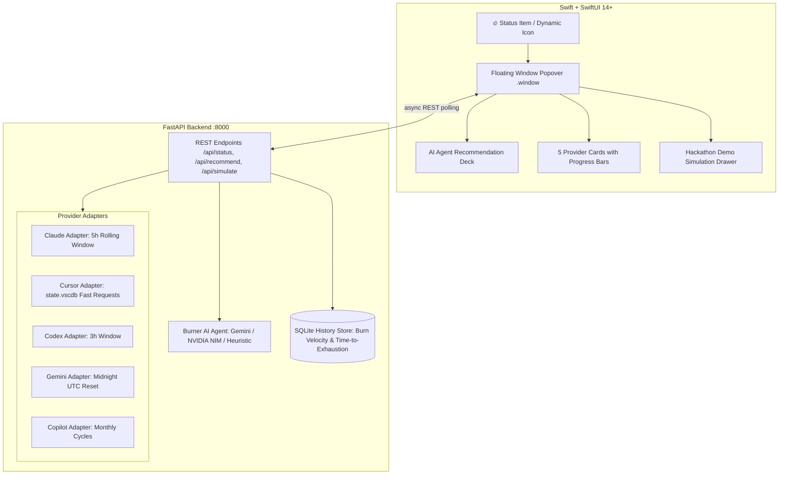

# Burner 🔥 — The AI Quota Menu Bar Agent

> **AI Builders Hackathon Submission**  
> *A native macOS menu bar agent that tracks your remaining quota across free-tier AI coding tools (Claude, Cursor, Codex, Gemini, Copilot), predicts burn-rate velocity, and proactively tells you which one to use next — before you hit a wall mid-task.*

---

## 🎯 The Problem

Developers and builders juggling multiple free-tier AI coding tools (Claude Sonnet, Cursor, ChatGPT/Codex, Google Gemini, and GitHub Copilot) encounter opaque, asynchronous rate limits with conflicting reset cadences (5-hour rolling windows, 3-hour caps, daily UTC resets, monthly allotments). 

Inevitably, developers discover they have hit a hard rate limit **mid-task during a complex refactor**, destroying momentum. While passive menu bar utilities (like *CodexBar*) excel at *displaying* raw numbers, none of them act on your behalf.

## 💡 The Solution: Burner

Burner is an **ambient macOS menu bar agent** that:
1. **Tracks 5 AI Coding Providers Locally**: Surfaces real-time remaining quota and countdowns using local session files and cache tokens (no paid Admin API required).
2. **Predicts Burn-Rate Velocity**: Measures consumption trajectory ($\Delta quota / \Delta time$) and warns you before you run out: *"At this pace, Claude will exhaust in 35 minutes — switch to Cursor for small edits to preserve Claude for architecture."*
3. **Autonomous Task Routing Agent**: Evaluates incoming task nature (Quick Edit, Deep Refactor, Boilerplate, Architecture) against remaining headroom, context window requirements, and reset windows. Powered by **Google Gemini** (Google Cloud credits), **NVIDIA NIM**, with a deterministic local heuristic fallback.
4. **One-Click Handoff & Hackathon Simulation**: Includes embedded interactive simulation controls for live judging demonstrations.

---

## 🏛️ System Architecture



---

## ⚡ Connected Providers (MVP)

| Provider | Model / Plan | Signal Source | Reset Window Cadence |
|---|---|---|---|
| **Claude** | Claude 3.5 Sonnet | `~/Library/Application Support/Claude/plan-usage-history.json` | 5-hour rolling reset window |
| **Cursor** | Fast Requests (Free) | `~/Library/Application Support/Cursor/.../state.vscdb` | Monthly / billing cycle allotment |
| **Codex** | GPT-4o mini / ChatGPT | Local session tokens & config cache | 3-hour rolling limit window |
| **Gemini** | Gemini 1.5 Pro / Flash | Google Cloud Application Default Credentials / API | Midnight UTC daily reset cycle |
| **Copilot** | GitHub Copilot Free/Ind. | GitHub CLI (`~/.config/gh/hosts.yml`) / Copilot cache | Monthly allotment cycle |

*Resilience guarantee: If a provider is not logged in or installed on the testing machine, its adapter seamlessly populates with interactive, realistic live simulation data.*

---

## 🚀 Quickstart

### Prerequisites
* macOS 14+ (Sonoma, Sequoia)
* Xcode 15+
* Python 3.10+

### Option A: One-Command Start
From the project root, run:
```bash
./start.sh
```
This automatically initializes the Python virtual environment, installs dependencies, boots the local agent engine, and launches the native macOS menu bar app.

### Option B: Manual Developer Run
1. **Start the local Agent backend:**
   ```bash
   cd server
   python3 -m venv venv
   source venv/bin/activate
   pip install -r requirements.txt
   uvicorn main:app --port 8000 --reload
   ```

2. **Open & run in Xcode:**
   * Open `BurnerApp/Burner.xcodeproj` in Xcode.
   * Press `Cmd + R` (Run).
   * The **🔥 flame icon** will appear in your top macOS menu bar.

---

## 🎬 Hackathon Demo Script (5-Minute Walkthrough)

1. **The Problem (0:00 - 1:00)**: Show how juggling Claude, Cursor, and Copilot leads to the dreaded *"You've reached your usage limit"* message in the middle of writing code.
2. **The Ambient Shell (1:00 - 2:00)**: Click the **🔥 Burner** menu bar icon. Show the floating popover with all 5 connected providers, real-time progress bars, and countdown timers.
3. **The Agentic Difference (2:00 - 3:15)**: 
   * Toggle the task selector:
     * Click **"Quick Edit"** → Agent immediately recommends **Cursor / Copilot** to preserve Claude's quota.
     * Click **"Deep Refactor"** → Agent routes to **Claude 3.5 Sonnet / Gemini Pro** for maximum reasoning depth.
4. **Live Limit Avoidance in Action (3:15 - 4:15)**:
   * Open the **Hackathon Simulation Drawer**.
   * Click **"Burn Claude (-25%)"** twice to simulate heavy usage dropping below 20%.
   * Watch the bar turn red, a native macOS notification alert fire, and the Agent automatically declare: *"Claude quota critical — rerouting architecture to Gemini Pro"*.
5. **Impact & Roadmap (4:15 - 5:00)**: Highlight how Burner transforms rate-limit surprises into proactive, zero-friction developer workflow routing.

---

## 📄 License
MIT License — Copyright (c) 2026 Sagar Sahu.
